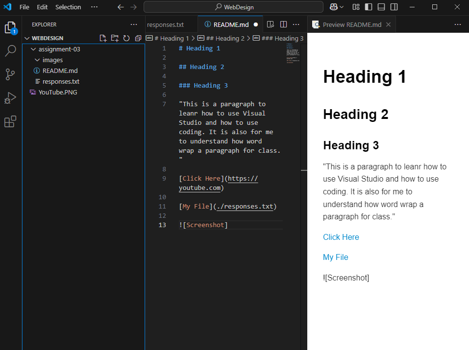

# Heading 1

## Heading 2

### Heading 3 

"This is a paragraph to leanr how to use Visual Studio and how to use coding. It is also for me to understand how word wrap a paragraph for class."

[Click Here](https://youtube.com)

[My File](./responses.txt)

