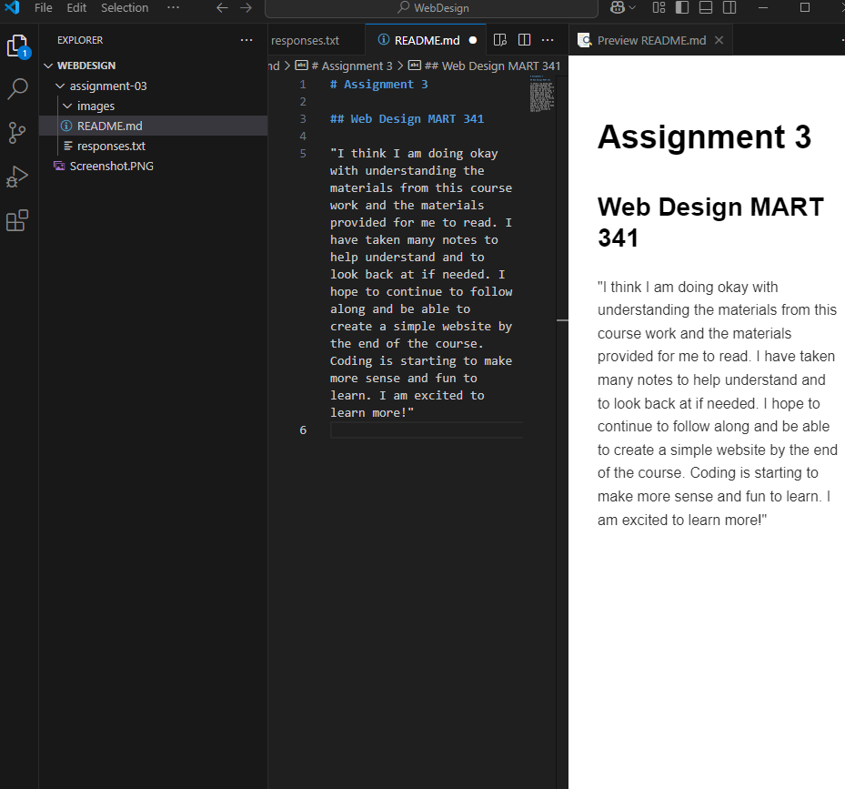

# Assignment 3

## Web Design MART 341

"I think I am doing okay with understanding the materials from this course work and the materials provided for me to read. I have taken **many notes** to help *understand* and to look back at if needed. I hope to continue to follow along and be able to create a simple website by the end of the course. Coding is starting to make more sense and fun to learn. I am excited to learn more!"

- Coding
- How to use Visual Studio
- Getting better with GitHub

[Click Here](https://google.com)

[My File](./responses.txt)

